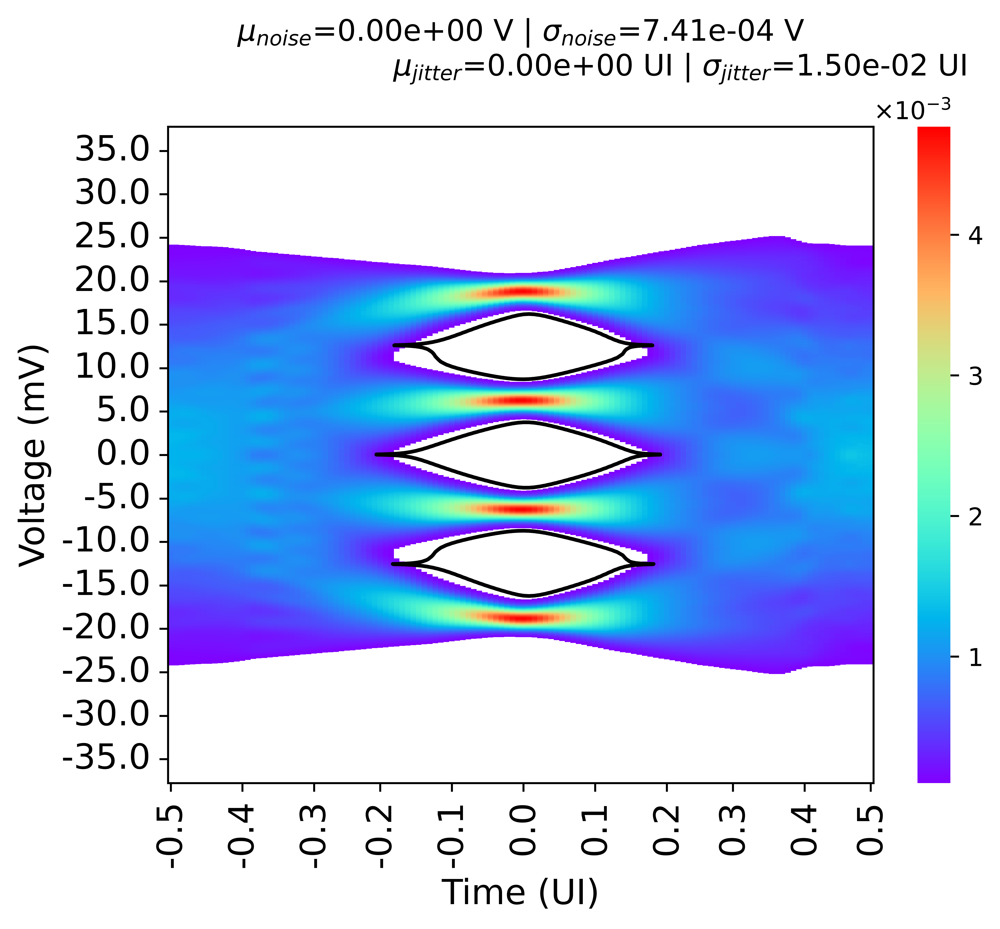

# pystateye - A Python Implementation of Statistical Eye Analysis and Visualization

## Introduction
Most of the work here is based on the OIF standard (https://www.oiforum.com/wp-content/uploads/2019/01/OIF-CEI-04.0.pdf)

## What makes this special?
Compared to the Matlab statistical eye diagram plotter, this Python implementation allows you to add impairments such as noise and jitter to the statistical eye diagram.

## Repository map
- <'statistical_eye.py'>: main file
- <'channel_pulse_response_test.csv'>: a test example used to test <'statistical_eye.py'>
- <'test.py'>: an example used to test the <'statistical_eye.py'>

## Variables in <statistical_eye.py>
implementation of statistical eye diagram with the inclusion of noise and jitter

- pulse_response: pulse response of the channel
- samples_per_symbol=8: samples per symbol
- vh_size=2048:
  vertical voltage discretized level, it has  to be even, and it has to be large enough.                     

  Its histogram bin interval should be very small for more accurate results. 
  You will see that as you keep increasing <vh_size>, the eye diagram gradually opens up. It is not because signal
  integrity has been improved, it is just an artifact that you are making the bin resolution higher. You should
  increase the size of <vh_size> until the artifact disappears (the eye does not change w.r.t. the size of <vh_size>).
  A good example is imaging you have a Gaussian distributed dataset you want to plot, which falls in between -1 and 1.
  If your bin resolution is super coarse, such as only two intervals, one from -1 to 0 and another one from 0 to 1,
  then you won't see any bell curve but just two bars that have the same counts. To see the bell curve, you need to 
  increase the bin resolution. 
  
  Another concern is regarding some numerical issues of the convolution, such as the boundary effects. This may result
  in the asymmetry of the eye diagram despite no linearity issue and the bin intervals being perfectly symmetric.
  To mitigate this issue, a large <vh_size> may be required. But then this will defeat the purpose of being fast using convolution...
                     
- M=4: 2 for NRZ and 4 for PAM4
- A_window_multiplier=2: control the vertical viewing space of the plot
- sample_size=16: how many symbols you want to sample across the pulse response, too many will lead to a long runtime
- mu_noise=0: mean value of noise in V, assuming Gaussian
- sigma_noise=1.33e-4: std value of noise in V, assuming Gaussian
- mu_jitter=0.0125: deterministic jitter, in terms of UI
- sigma_jitter=0.015: random jitter, in terms of UI
- target_BER=2.4e-4: target BER rate
- noise_flag=False: switch for including noise or not
- jitter_flag=False: switch for including jitter or not
- plot=False: switch for plotting eye diagram or not. You can turn it off if you use it in batch mode
- pdf_conv_flag=False: if you want to do pdf convolution to find all ISI combinations, False will then brute force find all combinations.
                        Either method has its pros and cons, but if the computation time/resource is not an issue, brute force is the most accurate method.
- diff_signal=True: eye diagram amplitude will be half of the pulse response magnitude
- upsampling=16: interpolate the time domain signal to give better visualization, also allows modeling higher sampling rate without frequency domain extrapolation
- interpolation_type='linear': interpolation scheme, can be either 'linear' or 'cubic'
- save_pics = False: save the picture to the disk or not
