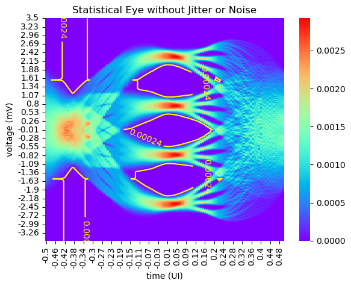

# pystateye - A Python Implementation of Statistical Eye Analysis and Visualization

## Introduction
Most of the work here are based on the OIF standard (https://www.oiforum.com/wp-content/uploads/2019/01/OIF-CEI-04.0.pdf)

## Repository map
- <'statistical_eye.py'>: main file
- <'channel_pulse_response_test.csv'>: a test example used to test <'statistical_eye.py'>
- <'test.py'>: an example used to test the <'statistical_eye.py'>
